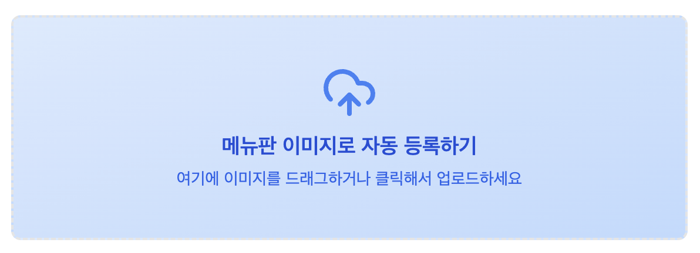
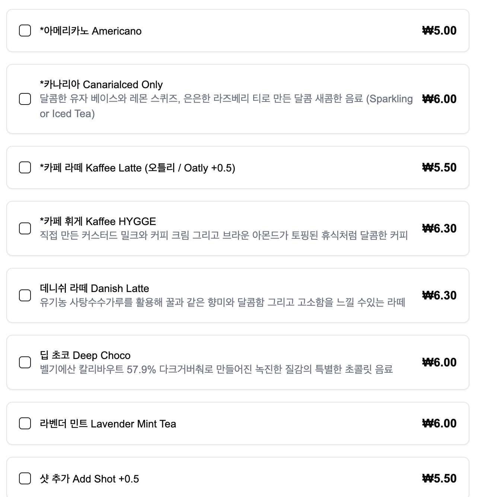
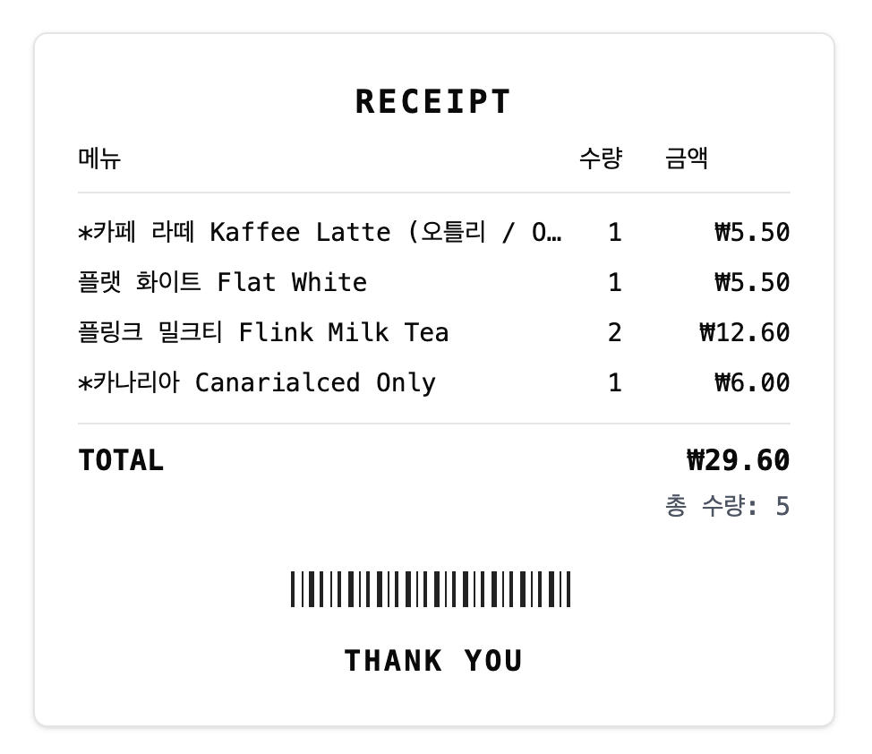

# ☕ 내가 쏜다 - 회사 커피 주문을 더 쉽게!

회사 동료들과 함께 커피를 주문할 때,  
일일이 카톡으로 메뉴를 받고 정리하느라 번거로우셨나요?

**‘내가 쏜다’**는 메뉴판 사진만 찍으면 자동으로 메뉴가 등록되고,  
주문 링크를 공유하면 동료들이 직접 입력!  
**자동으로 깔끔한 주문서 이미지까지 생성**해주는 앱입니다.

## 🌐 접속 주소

**https://hit-the-coffee.vercel.app/order/viaiUb**

---

## 📌 주요 기능

### 🚀 빠른 주문 링크 생성
- **매장 등록 없이** 메뉴판만 촬영하면 바로 주문 링크를 생성할 수 있습니다.
- 임시 매장으로 빠르게 시작하고, 나중에 정식 등록도 가능합니다.

### 🖼️ 메뉴 이미지 자동 등록
- 커피숍 메뉴판을 촬영하면 AI가 텍스트를 추출해 자동 등록합니다.
- 메뉴 하나하나 입력할 필요 없이 **간편하게 시작**할 수 있어요.

### 🔗 링크 공유로 주문 받기
- 생성된 주문 링크를 팀원들에게 공유하면,
- 각자가 원하는 메뉴를 **직접 선택**합니다.

### 🧾 자동 주문서 생성
- 입력된 주문은 **수량과 총액이 정리된 주문서 이미지**로 출력됩니다.
- 카카오톡, 슬랙, 이메일 등으로 바로 공유할 수 있어요.

---

## 🛠️ 사용 방법

### 🚀 빠른 주문 (추천)
1. **메뉴판 촬영**
    - 메뉴판을 촬영하면 AI가 자동으로 메뉴를 추출합니다.
2. **주문 링크 생성**
    - 매장 이름만 입력하면 바로 주문 링크가 생성됩니다.
3. **링크 공유**
    - 생성된 주문 링크를 복사해 동료들에게 전달합니다.
4. **자동 정리된 주문서 확인**
- 입력된 주문이 자동으로 정리되어 **이미지 주문서로 출력**됩니다.

### 📝 정식 등록
1. **커피숍 등록**
    - 앱에서 커피숍을 등록하고 메뉴판 사진을 업로드하세요.
2. **링크 공유**
    - 생성된 주문 링크를 복사해 동료들에게 전달합니다.
3. **자동 정리된 주문서 확인**
- 입력된 주문이 자동으로 정리되어 **이미지 주문서로 출력**됩니다.

---

## ✅ 이런 분께 추천해요!

- 회사에서 **자주 단체로 커피/음료를 주문하는 분**
- 주문 받을 때마다 **카톡방 정리로 스트레스 받는 분**
- 메뉴가 많아 **타이핑이 번거로운 분**

---

## 🖼️ 예시 화면

| 메뉴 등록 | 메뉴 | 주문서 출력 |
|-----------|--------------|
|  |  |  |

> 위 이미지는 예시이며, 앱 실행 시 생성되는 실제 주문서 이미지입니다.

---

## 🚀 지금 시작해보세요!

> 누구나, 어디서나 링크만 있으면 쉽게 사용할 수 있어요.

- [ ] 메뉴판 사진 한 장!
- [ ] 링크 하나로 주문 끝!
- [ ] 자동으로 주문서 출력!

---